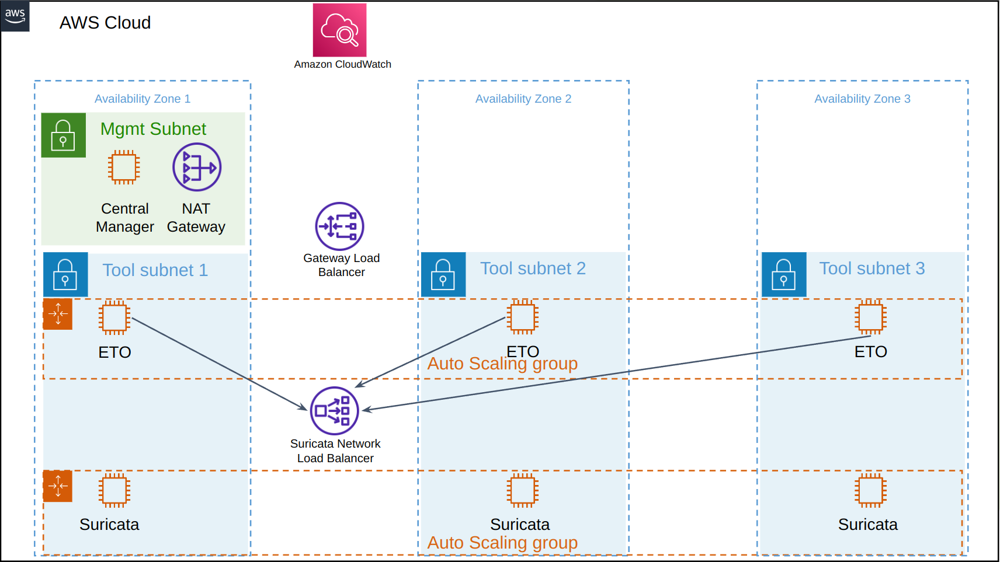
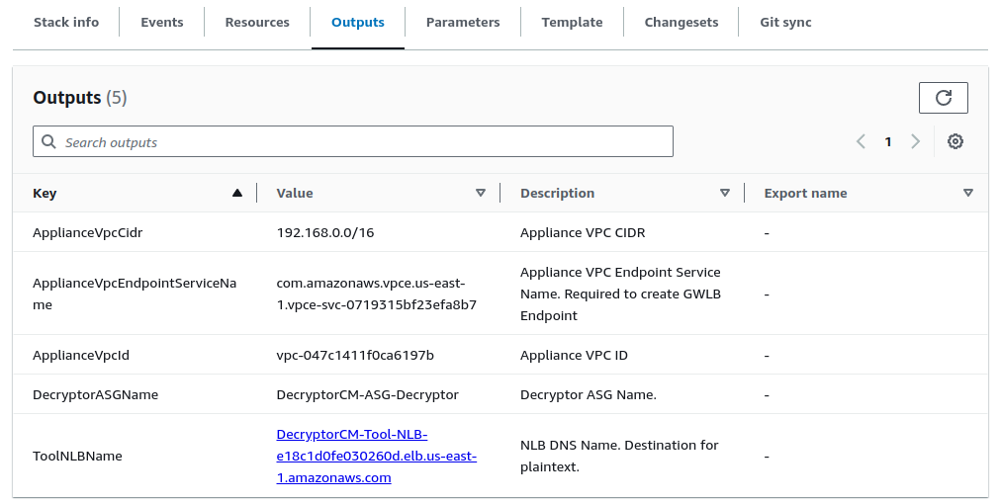
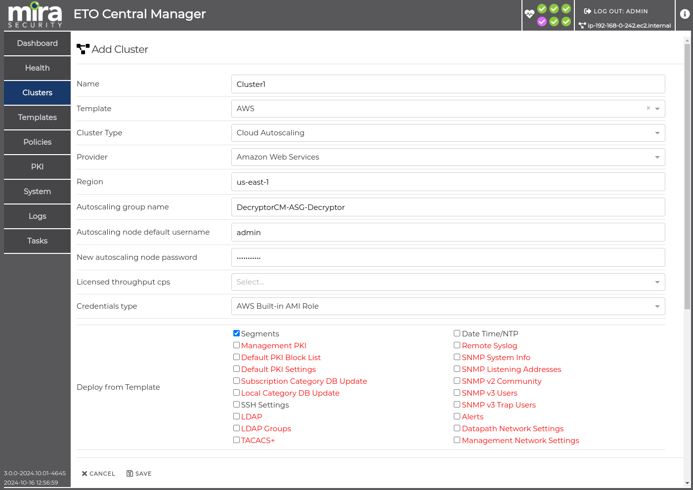
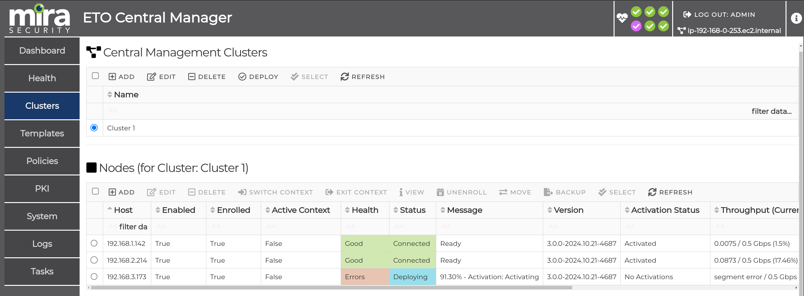

# AutoScaling Mira ETO with Central Manager and Suricata

This sample contains a CloudFormation template which demonstrates how to create a Autoscaling [Mira Encrypted Traffic Orchestrator (ETO)](https://mirasecurity.com/how-mira-works/eto-aws/) with a [Gateway Load Balancer (GWLB)](https://docs.aws.amazon.com/elasticloadbalancing/latest/gateway/introduction.html) and [Suricata](https://suricata.io/). The [Mira Central Manager (CM)](https://mirasecurity.com/how-mira-works/central-manager/) will deploy policies and configuration to the Auto Scaled ETOs.

This example is intended for initial proof of concept test beds. The CM and NAT gateway will only get deployed into a single availability zone within this example. The NAT gateway should be replicated to multiple AZs and a Standby High Availability CM in a secondary AZ should be created for production usage.

 \
_Figure 1: Central Manager with AutoScaling ETOs and Suricata Architecture_

The AWS Gateway Load Balancer routes the Spoke VPC traffic over to the Security VPC for traffic inspection and into an available ETO instance. The Mira ETO automatically detects SSL, TLS and SSH traffic on any port and can decrypt this traffic in order to send the unencrypted data to one or more security tools. The decrypted flows may be sent to a passive security tool using GENEVE or VXLAN tunnels. Decrypted data is sent to the Suricata Network Load Balancer with the same packet header details as the original encrypted flow encapsulated within the tunnel. Both outbound and inbound TLS flows can be decrypted using Certificate Authority resign or using existing server certificates and keys.

The Suricata Network Load Balancer will distribute the decrypted traffic to the Suricata Tools. The Suricata tools will send any alerts in the Suricata eve.json and fast.log file to AWS Cloudwatch for centralized log analysis.

A Central Manager cluster can be created that can track the AWS ETO autoscaling group. When an ETO AutoScaling event occurs, the node will automatically be enrolled into the Central Manager cluster. The ETO will get a license from CM if required, and will obtain the latest Policies and PKI from the CM cluster.

## **Security VPC**
The ETO requires two Elastic Network Adapter (ENA) interfaces. The first for the datapath traffic connection to GWLB and for transmitting plaintext decrypted traffic to the security tool, the second interface for the management WebUI and SSH. The Suricata and Central Manager require one ENA interface.

The CM in this example is placed into the public Subnet to allow for easy external access to the testbed.
Both ETO network interfaces are placed into a private Tool Subnet with a private IP that is only reachable from within the AWS VPC. The Suricata EC2 is also placed within the private Tool Subnet. A NAT gateway is created to provide the Suricata and ETOs outbound internet access for downloads.

Central Manager and ETO should be v3.0 or newer.

### Obtaining ETO AMI ID
If an AWS marketplace subscription is active for the [Mira ETO](https://aws.amazon.com/marketplace/seller-profile?id=seller-vh5fkitegcazg), the AMI ID may be obtained from the marketplace product, by clicking on “**Continue to Subscribe**” followed by “**Continue to Configuration**.” The desired ETO software version and region may be chosen which will provide the relevant AMI ID that can later be used in the CloudFormation submission.

The same method applies for [Mira Central Manager](https://aws.amazon.com/marketplace/pp/prodview-gv5qmbcn5n6a2).

### Creating CloudFormation stack

* **The steps to install the VPC-Security stack are as follows:**

    1. Navigate to AWS CloudFormation and create a new stack and upload the VPC-Security-ASG-CM.yaml file
    2. Give the VPC a unique Stack Name and select three different availability zones
    3. Under Security Groups and Keys, assign the EC2s a SSH KeyPair
    4. Under Security Groups and Keys, set the network CIDR subnet that can access the appliances management interfaces, the default 0.0.0.0/0 will create a security group rule to allow access from any client. To only allow SSH/Webui access from a single IP this may be set here, e.g. 21.22.11.55/32
    5. Under Decryptor Appliance Configuration, the ETO AMI ID should be entered, this is unique per AWS region and ETO license type
    6. The Decryptor instance type may be lowered to a lower cost type. If the AMI is obtained from the marketplace, ensure the chosen value matches a valid EC2 instance type as shown on the marketplace listing. The [Virtual ETO Product Brief](https://mirasecurity.com/resources/) also details the CPU and memory requirements for each licensed capacity
    7. Under Central Manager Configuration, the CM AMI ID should be entered, this is unique per AWS region

The other fields may be left at the default values. By default a public Elastic IP will be assigned to the CM EC2 management interfaces but this should be disabled if access is available using the private IP.

Once the form has been completed, click **Next**, followed by **Next**. Check the checkbox to allow for IAM capabilities to be created and click **Submit**.
The IAM role is required to run a Lambda script to provide the ApplianceVPCEndpointServiceName in the CloudFormation outputs to make this sample easier to use.

The CloudFormations yaml file will now create a new Security VPC, GWLB, CM EC2 instance and autoscaling groups. The stack progress may be monitored by clicking the refresh button. The stack should move to a CREATE_COMPLETE stage.

Navigate to the CloudFormation stack outputs tab and note the ApplianceVPCEndpointServiceName, this is the unique ID for the GWLB Endpoint Service and will be needed when connecting a Spoke’s Gateway Load Balancer Endpoint into this Security Stack.
The Decryptor ASG Name and NLB DNS hostname may be found in the CloudFormation Outputs tab which will be required when setting up the CM.

 \
_Figure 4: CloudFormation output tab_

### **Mira Central Manager set up**

The default password for the CM console “mira” user and WebUI “admin” user is the EC2 [instance-id], available from the AWS instance console. This will need to be reset on the first login.

The CM web management IP may be opened by copying the management network interface IP address from the EC2 Networking tab and prepending https://.

CM configuration is carried out using the CM's web UI to enable decryption and send plaintext traffic to the Suricata NLB. This is described within the [CM Virtual Appliance Getting Started Guide](https://srv.mirasecurity.com/lnk/cm-gsg-3.0.0). The ETO and CM Administration Guides are also available from the [Mira Support Site](https://support.mirasecurity.com).

PKI, Policies and a Segment should be created. The ETO Segment "Plaintext Port Tunnel Type" field also should be set to VXLAN and the remote host set to the Suricata NLB hostname, previously obtained from the CloudFormation Output tab. The NLB DNS hostname will be resolved on the ETOs to the 3 AZ subnet IPs, and the relevant AZ IP will be chosen.

 \
_Figure 5: Mira CM Segment plaintext tunnel settings_

A Template of platform type VM-AWS-3 should be created in CM and linked to the previously created Segment. On the cluster page, add a new cluster, and for Cluster Type selected Cloud AutoScaling and Amazon Web Services as the provider. The Region should be specified along with the AutoScaling group name which is available from the CloudFormations output tab.
A new AutoScaling node password should be entered, this is the password that the ETOs will be changed to after enrollment. The Licensed throughput cps may be left empty if the ETOs will obtain their license from the AWS marketplace.
For Credentials Type, this should be set as AWS Built-in AMI role as the CloudFormation template has created a new IAM role for the CM to give it the required access to the AWS APIs.
Within Deploy from Template, select Segments and click Save

 \
_Figure 6: Mira CM Cluster settings_

ETOs may now be created using EC2 AutoScaling, by navigating to ["Auto Scaling Groups"](https://us-east-1.console.aws.amazon.com/ec2/home?region=us-east-1#AutoScalingGroups:) on the AWS EC2 dashboard and selecting {stackname}-ASG-Decryptor. On Group Details, click edit and increment Desired Capacity to the capacity desired and click update, a capacity of atleast 3 should be chosen to ensure 1 decryptor instance per AZ. The EC2s will be evenly distributed across the multiple AZs.

After several minutes, the ETO will appear within the CM cluster nodes table and will be enrolled and deployed with the cluster template so that it may acquire the necessary configuration for decryption.
 \
_Figure 7: Mira CM Cluster nodes with a autoscaled ETO node enrolled_

The ETO logs may be viewed by selecting the ETO in the node table and clicking Switch Context. Navigating to Logs page on the CM will show the ETO node's session data. The context may be exited by clicking exit context on the top right pane.

### **Suricata AutoScaling set up**

The Suricata AutoScaling group requires no configuration. It just needs to be given a desired capacity similar to the ETO, by navigating to "Auto Scaling Groups" on the AWS EC2 dashboard and selecting {stackname}-ASG-IDS. On Group Details, click edit and increment Desired Capacity to the capacity desired and click update.

Suricata EC2s will spin up and auto download the Suricata docker image. The Suricata eve.json and fast.log alerts will be sent to CloudWatch within the /{stackname}/suricata/eve and /fast groups.

 \
_Figure 8: Suricata fast and eve logs available within CloudWatch_

### **Endpoint Spoke VPC set up**

The Spoke VPCs should now be set up to route the traffic via the GWLB using subnet routing. For all ETOs to be utilized, the Spoke VPC should also be located over 3 AZs.

For a simple client testbed, a VPC including 3AZs and AutoScaling clients is available within the [3az-applications-spoke-nginx](../3az-applications-spoke-nginx/) directory.

To secure an pre-existing VPC, a Gateway Load Balancer Endpoint should be created in that VPC to connect
into the GWLB. The GWLB Endpoint name that it will connect to was obtained earlier from the CloudFormation output tab field ApplianceVPCEndpointServiceName.
Consult the [AWS GWLB Getting Started Docs](https://docs.aws.amazon.com/elasticloadbalancing/latest/gateway/getting-started.html) for more information on how to set this up.
[VPC middlebox routing wizard](https://docs.aws.amazon.com/vpc/latest/userguide/gwlb-route.html) also can be used to automate the subnet routing.

## **Cleanup**

If the sample Autoscaled resources are no longer needed, the Autoscaled EC2s may be deleted by setting the Decryptor and Suricata AutoScaling Desired Capacity to 0. The ETO may take several minutes to stop, determined by the termination wait time set within the CloudFormation/AutoScaling group which is there to ensure existing flows have a chance to finish before the ETO is terminated.
To delete the entire CloudFormation Stack, navigate to CloudFormation and deleting any Spoke VPCs that connect into the GWLB, followed by deleting this Security VPC.
